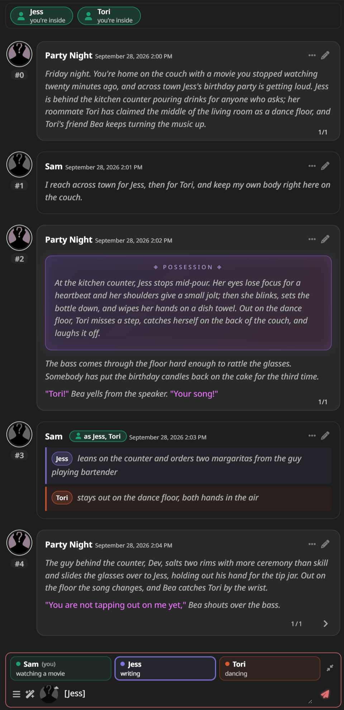
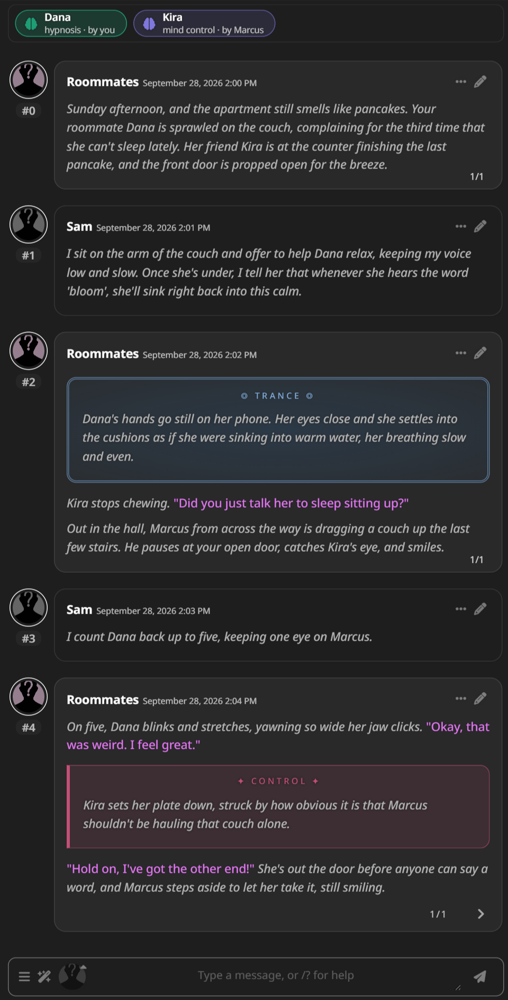
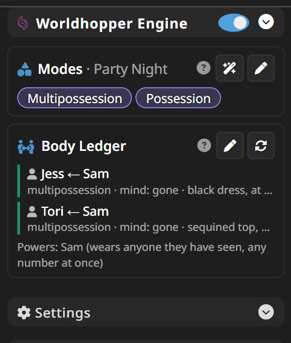
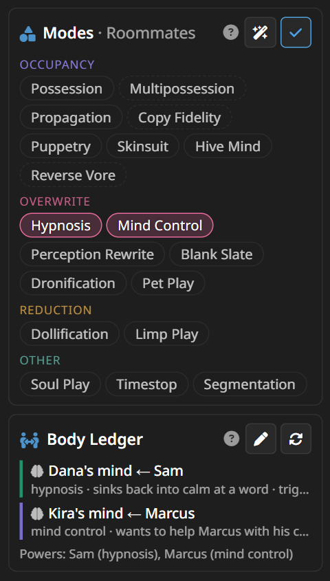
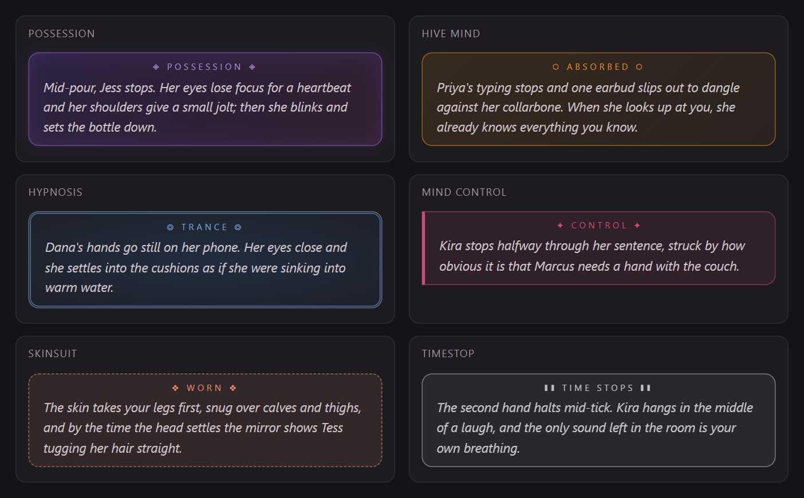
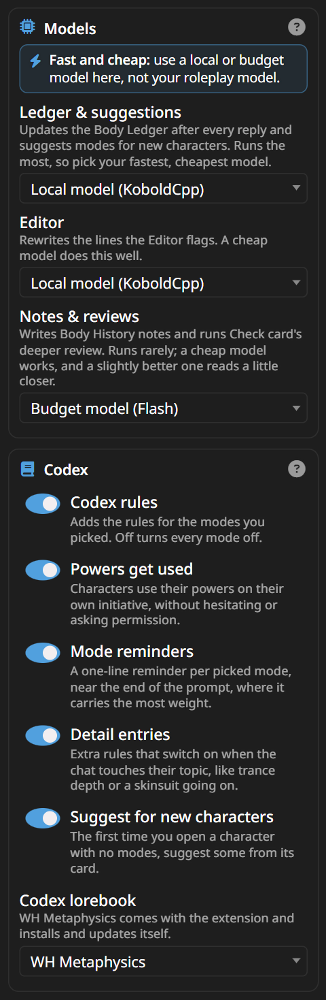
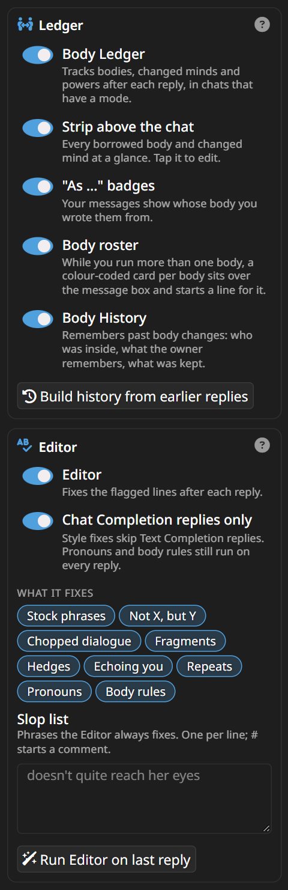

<h1 align="center">🌀 Worldhopper Engine</h1>

<p align="center">
A SillyTavern extension for metaphysics roleplay: possession, body swaps, mind control, hive minds, dolls, time stops and more.<br>
It keeps the rules, the bodies and the prose straight, so the model stops getting them wrong.
</p>

<p align="center">


</p>

It pairs with the [Worldhopper presets](https://coz-rp.github.io/) for Claude and Gemini, and works with any other preset, Chat Completion or Text Completion.

> 🧩 **Only what you're into.** Every mode is opt-in and picked per character, and nothing is on until you pick it. If mind control is your thing, pick Mind Control and that's all you'll ever get: no possession rules, no body swaps, no boxes or cards for modes you didn't choose. Mix as many or as few as you like, and change them any time.

> ⚡ **Keep it fast and cheap.** Give the Engine its own model, separate from the one you roleplay with. Its jobs are small background ones, and the Ledger runs after every single reply, so a local model (KoboldCpp, Ollama and the like) or a cheap, fast API model from the Flash, Haiku or mini tier does them well and costs next to nothing. Your big roleplay model would work too, but every background call would cost big-model prices, and your next reply waits for the Ledger to finish.

## Contents

- [✨ What it does](#-what-it-does)
- [🚀 Install](#-install)
- [🧭 Quick start](#-quick-start)
- [🎭 Modes](#-modes)
- [📒 Body Ledger](#-body-ledger)
- [👥 Running several bodies](#-running-several-bodies)
- [💥 Moment boxes](#-moment-boxes)
- [✍️ Editor](#️-editor)
- [🪪 Card tools](#-card-tools)
- [⚙️ Every setting](#️-every-setting)
- [⌨️ Slash commands](#️-slash-commands)
- [🧰 The regex scripts](#-the-regex-scripts)
- [🔒 Privacy](#-privacy)
- [❓ Troubleshooting](#-troubleshooting)

## ✨ What it does

| | |
|---|---|
| 🎭 **Codex modes** | Rules for 19 kinds of metaphysics, switched on only in the chats of characters that use them. |
| 📒 **Body Ledger** | After every reply, records who is in which body, whose mind was changed and how, and who holds which power, then feeds it back to the model. |
| 🟢 **Strip and badges** | Every borrowed body and changed mind at a glance above the chat: teal when you're the one doing it, violet when someone else is. |
| 👥 **Body roster** | Run several bodies at once and each gets a colour-coded card over the message box that starts a line for it. |
| 💥 **Moment boxes** | A takeover, an absorption, a trance, a will taking hold, time stopping: each mode's big moment gets its own styled box. |
| ✍️ **Editor** | Flags stock phrases, "not X, but Y" framing and chopped dialogue, and has a model rewrite only those lines. One tap brings the original back. |
| 🪪 **Card tools** | Make a character from a Card Builder chat, modes and all, and check any card for the things that trip models up. |

## 🚀 Install

1. In SillyTavern, open **Extensions** → **Install extension**, and paste:
   ```
   https://github.com/Coz-rp/SillyTavern-Worldhopper
   ```
2. Open **Extensions → Worldhopper Engine → Settings → Models** and pick a connection profile for each job: a local or cheap, fast model, not your roleplay model (see [Models](#models)).
3. Open a character and pick its modes. That's it.

**You need** SillyTavern with the built-in Connection Manager (tested on 1.18), and a connection profile for the Engine's jobs (plug menu → Connection Profile), ideally pointing at a local or budget model. No special preset is needed: the Engine writes its own prompts, and a profile's preset only lends its sampler settings.

**On first start** the extension installs its lorebook, **WH Metaphysics**, and a handful of display-only regex scripts (see [The regex scripts](#-the-regex-scripts)). Both update themselves with the extension. If you edit your copy of either, your edits stay, and the extension asks before replacing anything.

**By hand:** copy this folder into `SillyTavern/public/scripts/extensions/third-party/` and restart SillyTavern.

## 🧭 Quick start



1. Open a chat with a character.
2. In **Extensions → Worldhopper Engine**, tap ✏️ under **Modes** and pick what this character uses, or tap 🪄 to have some suggested from the card.
3. Play. After each reply the Ledger updates, and the strip above the chat shows who is where.

Every section of the panel has a ❔ button that explains it in a few lines, and every switch in Settings says what it does right under its name.

<br clear="right">

## 🎭 Modes

A mode is one kind of metaphysics, with its own rules: how it's done, what the subject experiences, who writes what. The rules live in the **WH Metaphysics** lorebook, the Codex. Its entries stay off everywhere, and Worldhopper switches on only the ones for the modes you picked, only in that character's chats.



- **Picked per character** (or per group chat). Tap ✏️ to pick, 🪄 to get suggestions from the card, and tap a picked mode to read what it means.
- **Pick the fewest that carry the card.** Every picked mode is written into every reply, so a mode the card only hints at does more harm than good.
- **Modifiers** (↳) build on another mode and bring it in with them: Multipossession brings in Possession.
- **What gets added:** the core rules for your modes; a one-line reminder per mode near the end of the prompt, where it carries the most weight; and detail entries that switch on when the chat touches their topic, like trance depth or a skinsuit going on.
- **Your card wins.** The card sets the specifics (how a power works, what it costs, what the subject remembers); a mode's defaults only fill in what the card leaves out.

<br clear="right">

| Family | Mode | What it is |
|---|---|---|
| **🧍 Occupancy** | Possession | a mind moves into a living host and drives it |
|  | ↳ Multipossession | one mind drives several hosts at once (brings in Possession) |
|  | Propagation | a host's mind is overwritten by a copy of someone else's |
|  | ↳ Copy Fidelity | copies of the player character appear in the story (brings in Propagation) |
|  | Puppetry | an empty body driven from outside by a controller in their own skin |
|  | Skinsuit | a host's hollow skin is worn from within like a garment |
|  | Hive Mind | minds absorbed into a single network that is the original mind |
|  | ↳ Reverse Vore | entry by being swallowed, then control seized from inside (with any occupancy mode; brings in Possession if none is picked) |
| **🧠 Overwrite** | Hypnosis | suggestions implanted and sincerely rationalised as the subject's own |
|  | Mind Control | the mind itself taken over: wants, feelings and beliefs set by the controller and felt as the subject's own |
|  | Perception Rewrite | premises edited so the altered normal is defended as always true |
|  | Blank Slate | a mind wiped to a genuine void |
|  | Dronification | personality stripped and replaced with function and designations |
|  | Pet Play | the mind becomes an animal's while the body stays human |
| **🪆 Reduction** | Dollification | a blank, poseable doll with nobody home |
|  | Limp Play | the body goes completely slack, dead weight |
| **✨ Other** | Soul Play | souls as objects that can be moved, split, merged or stored |
|  | Timestop | time frozen for everyone except whoever stopped it |
|  | Segmentation | body parts removed and exchanged freely |

## 📒 Body Ledger

After each reply, a model you choose reads the newest messages and updates a record of:

- 🧍 **Bodies** that aren't driven by their own mind: possessed, worn as a skin, absorbed into a hive, overwritten by a copy, puppeted, swapped. Also empty bodies, and minds with no body.
- 🧠 **Minds** a power has changed while they stay in their own body: hypnosis, mind control, perception rewrites, blank slates, drones, pets, dolls, limp bodies. Each with what changed, any triggers ("'bloom' drops her into a trance") and how they are right now.
- ⚡ **Powers**: who can do what, even when nobody is using it.
- 🏷️ **Names**: one person under several names (a code name, a host number).
- 🙈 **Whether you know.** Anything kept from you stays out of the narration, and out of the strip's details.

The record goes into the prompt just before the model writes, so names, pronouns and every change stay straight. When it's your doing, the model is told that only you set or change it; when it's done to you, the model plays your changed behaviour and leaves your inner experience to you.

**The strip** above the chat shows it at a glance: 🟢 teal when you're the one doing it (inside a body, or controlling a mind), 🟣 violet when someone else is, dashed when a body is empty or something is hidden from you. Tap it to edit.

**"As …" badges** on your messages show whose body you wrote them from.

**Body History** remembers past body changes: who was inside, what the owner remembers, what was kept or left behind. For a chat that started before the Ledger was on, **Build history from earlier replies** reads the replies that have no Ledger entry yet, once each. On a long chat it offers to read just the last 30 instead of the whole thing.

**It never rereads the chat.** After each reply the Ledger reads only the newest messages, alongside what it already knows.

**Fixing mistakes:** ✏️ opens the Ledger to edit; the next update builds on your fix. 🔄 rebuilds it from the card and the last few messages.

**Which model:** the Ledger runs after every reply, and your next reply waits for it, so give it your fastest, cheapest model: a local one, or the Flash, Haiku or mini tier. With only Timestop picked there's nothing to track, so it stays off.

## 👥 Running several bodies


With Multipossession, as a hive's original mind, or working puppets, you run more than one body at once. The **body roster** makes that easy:

- A card per body sits over the message box, in that body's colour, with what it's doing. Your own body is marked *(you)*.
- **Tap a card** to start a line for that body, like `[Jess] leans on the counter`. The card for the line you're on lights up; cards that already have a line say so.
- A line with no name is you as a whole, and goes to whichever bodies it fits. `Jess:` at the start of a line works too.
- Your lines show in the chat as rows in the same colours.
- **Your bodies are yours.** The writer only ever does what you wrote with them, with nothing added. A body you gave nothing stays as you left it; if someone speaks to it, the reply stops and leaves the answer to you.
- **Copies are their own people.** With Propagation, copies of you are separate people the writer plays, so they never get cards.
- Past six bodies the cards shrink to chips, and the corner button shrinks them any time.

<br clear="right">

## 💥 Moment boxes

<p align="center"></p>

The Codex asks the model to mark each mode's big moment, and a display-only regex script turns the marked passage into a styled box. Only the moment gets a box (one to three paragraphs, never the whole reply), the prose inside reads exactly as it would without it, and **nothing you haven't been told about ever gets a box**, since the box itself would give it away.

| Mode | The moment | Marked as |
|---|---|---|
| Possession | a takeover, and a release | `%%possession%%`, `%%release%%` |
| Hive Mind | someone being absorbed | `%%absorbed%%` |
| Skinsuit | a suit going on, and coming off | `%%worn%%`, `%%shed%%` |
| Hypnosis | going under, or a trigger firing | `%%trance%%` |
| Mind Control | a will taking hold | `%%control%%` |
| Timestop | time stopping, and resuming | `%%timestop%%`, `%%resume%%` |

Each marker closes with its slash twin (`%%/trance%%`). The model only sees these instructions for the modes you picked.

## ✍️ Editor

After each reply, a quick rule pass flags suspect lines, and the Editor model rewrites **only those lines**; nothing else in the reply changes. ⟲ in a message's menu switches between the original and the fixed version.

| Check | What it catches |
|---|---|
| Stock phrases | Common model tells and stock phrasing |
| Not X, but Y | "Not a threat, but a promise" framing |
| Chopped dialogue | Dialogue broken into staccato fragments |
| Fragments | Narration in sentence fragments |
| Hedges | Referent hedges like "your — her — hand" |
| Echoing you | Speech that parrots your words back |
| Repeats | Phrases repeated from recent replies |
| Pronouns | A body's pronouns and the mind's inside it, checked against the Ledger |
| Body rules | Cuts lines that break the body rules: one mind's bodies chatting with each other, narration pointing out who's inside, hints at things you haven't been told |

Add your own phrases to the **slop list**, one per line. **Run Editor on last reply** runs it on demand, even while it's off.

## 🪪 Card tools

Both live in the wand menu.

- **Make card** turns a finished [Metaphysics Card Builder](https://coz-rp.github.io/) chat into a real character, with its Codex modes already picked.
- **Check card** reviews the open character's card: persona names where `{{user}}` belongs, a system prompt that replaces your preset's, too many tokens sent every reply, mind control written as a trapped victim, pointers in the greetings, and more. **Deeper review** asks your Notes model for a closer read.

## ⚙️ Every setting

<table align="center"><tr>
<td valign="top"></td>
<td valign="top"></td>
</tr></table>

### Models

Background jobs run through your connection profiles, separate from the model you chat with. **Use a local model or a cheap, fast API model for all three**, not your roleplay model: the jobs are small, so a budget model does them well, and they stay quick and nearly free. A job with no model picked simply doesn't run.

| Setting | What it does | Suggested |
|---|---|---|
| Ledger & suggestions | Updates the Body Ledger after every reply, and suggests modes for new characters | Your fastest, cheapest model: it runs the most, and your next reply waits for it |
| Editor | Rewrites the lines the Editor flags | A cheap model does this well |
| Notes & reviews | Writes Body History notes, and runs Check card's deeper review | Runs rarely; cheap works, a slightly better model reads a little closer |

### Codex

| Setting | What it does | Default |
|---|---|---|
| Codex rules | Adds the rules for the modes you picked. Off turns every mode off | On |
| Powers get used | Characters use their powers on their own initiative, without hesitating or asking permission | On |
| Mode reminders | A one-line reminder per picked mode near the end of the prompt | On |
| Detail entries | Extra rules that switch on when the chat touches their topic | On |
| Suggest for new characters | The first time you open a character with no modes, suggests some from its card | On |
| Codex lorebook | Which lorebook holds the rules | WH Metaphysics |

### Ledger

| Setting | What it does | Default |
|---|---|---|
| Body Ledger | Tracks bodies, changed minds and powers after each reply, in chats that have a mode | On |
| Strip above the chat | Every borrowed body and changed mind at a glance; tap it to edit | On |
| "As …" badges | Your messages show whose body you wrote them from | On |
| Body roster | A card per body over the message box while you run more than one | On |
| Body History | Remembers past body changes and what they left behind | On |
| Build history from earlier replies | For older chats: reads the replies with no Ledger entry, once each (the last 30, or the whole chat) | (button) |

### Editor

| Setting | What it does | Default |
|---|---|---|
| Editor | Fixes the flagged lines after each reply | On |
| Chat Completion replies only | Style fixes skip Text Completion replies; pronouns and body rules still run on every reply | On |
| What it fixes | The checks in the [Editor](#️-editor) table, each switchable | All on |
| Slop list | Phrases it always fixes, one per line; `#` starts a comment | Empty |
| Run Editor on last reply | Runs it now, even while it's off | (button) |

## ⌨️ Slash commands

| Command | What it does |
|---|---|
| `/wh-modes` | Shows the current character's modes; `/wh-modes Possession, Skinsuit` sets them |
| `/wh-ledger` | Shows the Ledger; `rebuild`, `edit`, `history` and `backfill` do what they say |
| `/wh-edit` | Runs the Editor on the last reply, or on a message id |

## 🧰 The regex scripts

All display-only: they change how messages look, never what the model reads.

| Script | What it does |
|---|---|
| WH - Possession | Turns a marked takeover into a possession box |
| WH - Release | Turns a marked release into a release box |
| WH - Moments | The boxes for every other mode's moment |
| WH - Stray markers | Hides a marker whose partner went missing |
| WH - Body lines | Turns your `[Name]` lines into colour-coded rows |

You can edit, disable or delete them; the extension leaves your changes alone. They're also on [the site](https://coz-rp.github.io/) as files, in case you ever need to import them yourself.

## 🔒 Privacy

The extension sends chat text only to the connection profiles you pick under Models: the Ledger model reads the last few messages after each reply, the Editor model reads the lines it fixes, the Notes model reads the messages around an ended body change, and a deeper card review sends that card. Nothing else leaves your SillyTavern, and there's no telemetry.

## ❓ Troubleshooting

- **Nothing seems to happen.** Pick the character's modes (✏️ under Modes), and make sure a model is picked for **Ledger & suggestions**.
- **The Ledger got something wrong.** Tap ✏️ on the Body Ledger and fix it; the next update builds on your fix. 🔄 rebuilds it from the card and the last few messages.
- **Deeper review takes a while.** A thorough read usually takes under a minute on a cheap model; the button counts the seconds, a second tap cancels, and after three minutes it stops on its own.
- **I see `%%trance%%` or other markers as text.** The display scripts are off or gone: check Extensions → Regex, or import them from [the site](https://coz-rp.github.io/).
- **"This version of Worldhopper has a newer Codex".** Your copy of WH Metaphysics has edits of your own, so it wasn't replaced. **Update (keep mine as a copy)** installs the new one and keeps yours alongside.
- **The Ledger stays off.** With only Timestop picked there's nothing for it to track; otherwise check that it's on and has a model.
- **Text Completion.** The Codex and the Ledger work the same; the Editor's style fixes skip Text Completion replies unless you turn off **Chat Completion replies only**.

## 🔌 Optional: phone off-switch

`extras/wh-power` is a small Windows server plugin that adds **Shut down SillyTavern** to the wand menu, for switching SillyTavern off from your phone. It isn't installed with the extension; see its README.

## 💜 Credits

Worldhopper Engine by Coz, built with Claude. The Worldhopper 1.0 presets, the Metaphysics Card Builder and the WH Cardmaker preset are on [coz-rp.github.io](https://coz-rp.github.io/).
