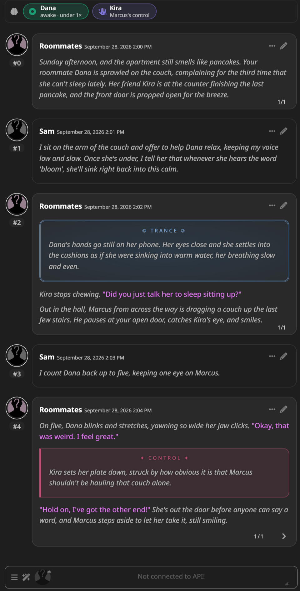
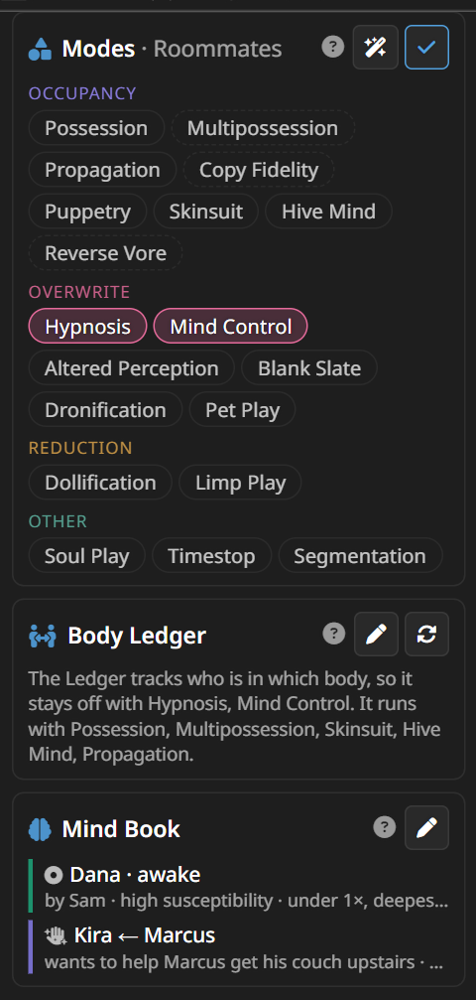
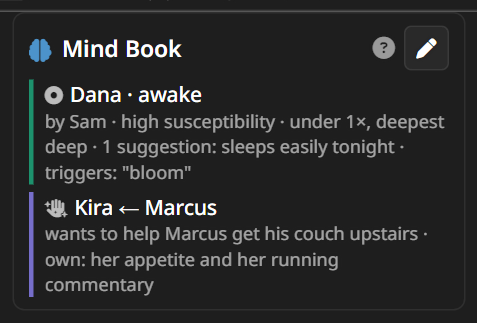
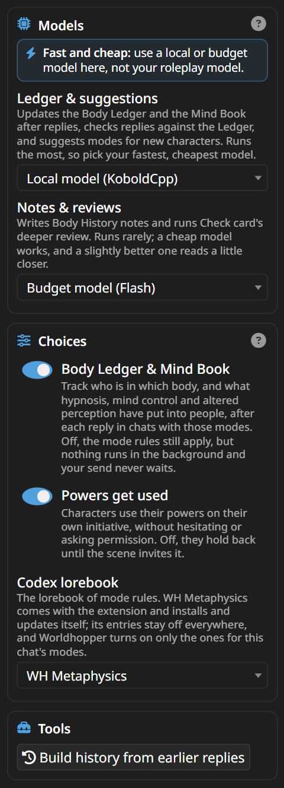

<h1 align="center">🌀 Worldhopper Engine</h1>

<p align="center">
A SillyTavern extension for metaphysics roleplay: possession, body swaps, mind control, hive minds, dolls, time stops and more.<br>
It keeps the rules, the bodies and the prose straight, so the model stops getting them wrong.
</p>

<p align="center">


</p>

It pairs with the [Worldhopper preset](https://coz-rp.github.io/) (one preset for Claude, Gemini, DeepSeek and GLM), and works with any other preset, Chat Completion or Text Completion.

> 🧩 **Only what you're into.** Every mode is opt-in and picked per character, and nothing is on until you pick it. If mind control is your thing, pick Mind Control and that's all you'll ever get: no possession rules, no body swaps, no boxes or cards for modes you didn't choose. Mix as many or as few as you like, and change them any time.

> ⚡ **Keep it fast and cheap.** Give the Engine its own model, separate from the one you roleplay with. Its jobs are small background ones, and the Ledger runs after every single reply, so a local model (KoboldCpp, Ollama and the like) or a cheap, fast API model from the Flash, Haiku or mini tier does them well and costs next to nothing. Your big roleplay model would work too, but every background call would cost big-model prices, and your next reply waits for the Ledger to finish.

## Contents

- [✨ What it does](#-what-it-does)
- [🚀 Install](#-install)
- [🧭 Quick start](#-quick-start)
- [🎭 Modes](#-modes)
- [📒 Body Ledger](#-body-ledger)
- [🧠 Mind Book](#-mind-book)
- [👥 Running several bodies](#-running-several-bodies)
- [💥 Moment boxes](#-moment-boxes)
- [✍️ WH Editor](#️-wh-editor)
- [🪪 Card tools](#-card-tools)
- [⚙️ Every setting](#️-every-setting)
- [⌨️ Slash commands](#️-slash-commands)
- [🧰 The regex scripts](#-the-regex-scripts)
- [🔒 Privacy](#-privacy)
- [❓ Troubleshooting](#-troubleshooting)

## ✨ What it does

| | |
|---|---|
| 🎭 **Codex modes** | Rules for 19 kinds of metaphysics, switched on only in the chats of characters that use them. |
| 🧠 **Mind Book** | What Hypnosis, Mind Control and Altered Perception have put into people (trance stages and triggers, a controlled will, who can't perceive what), with a line for the moment when a trigger is spoken or a hidden person walks in. |
| 📒 **Body Ledger** | In possession-type chats, records after every reply who is in which body and who holds which power, then feeds it back to the model. |
| 🟢 **Strip and badges** | Every borrowed body at a glance above the chat: teal when you're the one inside, violet when someone else is. |
| 👥 **Body roster** | Run several bodies at once and each gets a colour-coded card over the message box that starts a line for it. |
| 💥 **Moment boxes** | A takeover, an absorption, a trance, a will taking hold, time stopping: each mode's big moment gets its own styled box. |
| ✍️ **WH Editor** | A separate extension that pairs with this one: flags stock phrases, "not X, but Y" framing and chopped dialogue, and has a model rewrite only those lines. |
| 🪪 **Card tools** | Make a character from a Card Builder chat, modes and all, and check any card for the things that trip models up. |

## 🚀 Install

1. In SillyTavern, open **Extensions** → **Install extension**, and paste:
   ```
   https://github.com/Coz-rp/SillyTavern-Worldhopper
   ```
2. Open **Extensions → Worldhopper Engine → Settings → Models** and pick a connection profile for each job: a local or cheap, fast model, not your roleplay model (see [Models](#models)).
3. Open a character and pick its modes. That's it.

**You need** SillyTavern with the built-in Connection Manager (tested on 1.18), and a connection profile for the Engine's jobs (plug menu → Connection Profile), ideally pointing at a local or budget model. No special preset is needed: the Engine writes its own prompts, and a profile's preset only lends its sampler settings.

**On first start** the extension installs its lorebook, **WH Metaphysics**, and a handful of display-only regex scripts (see [The regex scripts](#-the-regex-scripts)). Both update themselves with the extension. If you edit your copy of either, your edits stay, and the extension asks before replacing anything.

**By hand:** copy this folder into `SillyTavern/public/scripts/extensions/third-party/` and restart SillyTavern.

## 🧭 Quick start


1. Open a chat with a character.
2. In **Extensions → Worldhopper Engine**, tap ✏️ under **Modes** and pick what this character uses, or tap 🪄 to have some suggested from the card.
3. Play. After each reply the Ledger updates, and the strip above the chat shows who is where. With Hypnosis, Mind Control or Altered Perception picked, the Mind Book's bar sits under it.

Every section of the panel has a ❔ button that explains it in a few lines, and every switch in Settings says what it does right under its name.

<br clear="right">

## 🎭 Modes

A mode is one kind of metaphysics, with its own rules: how it's done, what the subject experiences, who writes what. The rules live in the **WH Metaphysics** lorebook, the Codex. Its entries stay off everywhere, and Worldhopper switches on only the ones for the modes you picked, only in that character's chats.



- **Picked per character** (or per group chat). Tap ✏️ to pick, 🪄 to get suggestions from the card, and tap a picked mode to read what it means.
- **Pick the fewest that carry the card.** Every picked mode is written into every reply, so a mode the card only hints at does more harm than good.
- **Modifiers** (↳) build on another mode and bring it in with them: Multipossession brings in Possession.
- **What gets added:** the core rules for your modes; a one-line reminder per mode near the end of the prompt, where it carries the most weight; and detail entries that switch on when the chat touches their topic, like trance depth or a skinsuit going on.
- **Your card wins.** The card sets the specifics (how a power works, what it costs, what the subject remembers); a mode's defaults only fill in what the card leaves out.

<br clear="right">

| Family | Mode | What it is |
|---|---|---|
| **🧍 Occupancy** | Possession | a mind moves into a living host and drives it |
|  | ↳ Multipossession | one mind drives several hosts at once (brings in Possession) |
|  | Propagation | a host's mind is overwritten by a copy of someone else's |
|  | ↳ Copy Fidelity | copies of the player character appear in the story (brings in Propagation) |
|  | Puppetry | an empty body driven from outside by a controller in their own skin |
|  | Skinsuit | a host's hollow skin is worn from within like a garment |
|  | Hive Mind | minds absorbed into a single network that is the original mind |
|  | ↳ Reverse Vore | entry by being swallowed, then control seized from inside (with any occupancy mode; brings in Possession if none is picked) |
| **🧠 Overwrite** | Hypnosis | realistic trances that deepen in stages over sessions, with suggestions sincerely rationalised as the subject's own |
|  | Mind Control | the mind itself taken over: wants, feelings and beliefs set by the controller and felt as the subject's own |
|  | Altered Perception | premises edited so the altered normal is defended as always true |
|  | Blank Slate | a mind wiped to a genuine void |
|  | Dronification | personality stripped and replaced with function and designations |
|  | Pet Play | the mind becomes an animal's while the body stays human |
| **🪆 Reduction** | Dollification | a blank, poseable doll with nobody home |
|  | Limp Play | the body goes completely slack, dead weight |
| **✨ Other** | Soul Play | souls as objects that can be moved, split, merged or stored |
|  | Timestop | time frozen for everyone except whoever stopped it |
|  | Segmentation | body parts removed and exchanged freely |

## 📒 Body Ledger

The Ledger is for the modes where one mind lives in another's body: Possession, Multipossession, Skinsuit, Hive Mind, Reverse Vore, Propagation and Copy Fidelity. In a chat with none of those it stays out entirely, even if the chat holds Ledger entries from before: it doesn't run, doesn't go into the prompt and doesn't show, so a hypnosis or mind control chat is the Mind Book's alone. Pick one of those modes and the Ledger comes back as it was. After each reply, a model you choose reads the newest messages and updates a record of:

- 🧍 **Bodies** that aren't driven by their own mind: possessed, worn as a skin, absorbed into a hive, overwritten by a copy, swapped. Also empty bodies, and minds with no body.
- ⚡ **Powers**: who can do what, even when nobody is using it.
- 🏷️ **Names**: one person under several names (a code name, a host number).
- 🙈 **Whether you know.** Anything kept from you stays out of the narration, and out of the strip's details.

The record goes into the prompt just before the model writes, so names, pronouns and every change stay straight. When it's your doing, the model is told that only you set or change it; when it's done to you, the model plays your changed behaviour and leaves your inner experience to you.

**The strip** above the chat shows it at a glance: 🟢 teal when you're the one inside, 🟣 violet when someone else is, dashed when a body is empty or something is hidden from you. Tap it to edit.

**"As …" badges** on your messages show whose body you wrote them from.

**Body History** remembers past body changes: who was inside, what the owner remembers, what was kept or left behind. For a chat that started before the Ledger was on, **Build history from earlier replies** reads the replies that have no Ledger entry yet, once each. On a long chat it offers to read just the last 30 instead of the whole thing.

**It never rereads the chat.** After each reply the Ledger reads only the newest messages, alongside what it already knows.

**Two checks on every reply** while someone is in another body, Text Completion included: **pronouns** (a body's own, and the mind's inside it) are checked against the Ledger, and lines that break the **body rules** are cut (one mind's bodies chatting with each other, narration pointing out who's inside, hints at things you haven't been told). ⟲ in the message menu brings the original back.

**A body stays on until it's let go.** A possession ends only when the chat shows it ending: the driver leaving, being forced out or letting go, or the owner taking back control. A scene moving elsewhere, or a body nobody has mentioned for a while, ends nothing. When an update does take a body off, a second, quick check confirms it first.

**Fixing mistakes:** ✏️ opens the Ledger to edit; the next update builds on your fix. 🔄 rebuilds it from the card and the last few messages.

**Which model:** the Ledger runs after every reply, and your next reply waits for it, so give it your fastest, cheapest model: a local one, or the Flash, Haiku or mini tier. Under the Ledger's status, **Last turn** shows how long your send waited on it and how long it, the Mind Book and the body checks took on the last reply.

## 🧠 Mind Book



The Body Ledger's counterpart for the modes that change a mind instead of moving one: **Hypnosis**, **Mind Control** and **Altered Perception**. Each keeps its own record, updated by its own small prompt, so they never blur into each other or into the Ledger.

- 🌀 **Hypnosis** is realistic: inductions take patience, depth comes in stages (light, medium, deep, somnambulistic), and every session makes the next one quicker and deeper. For each subject the book keeps who hypnotizes them, how susceptible they are, how many times they've been under and how deep, where they are right now, the suggestions planted (each with the stage it went in at, which decides how long it lasts and what's remembered), triggers, and whether they were told to forget. The prompt gets only the line for where they are right now: what this stage allows, and how it shows.
- 🎯 **Mind Control** keeps each controlled person's will: what the controller set (wants, feels, believes, loyal to, standing commands), with a newer setting replacing an older one, and what is still their own. Unless the card or the story in play makes them drones or zombies, or sets them up as aware of it and pushing against it, they stay fully themselves apart from their will, pursue it in their own way, and nothing in them strains against it.
- 👁️ **Altered Perception** keeps each edit: someone who can't be perceived, a changed normal, or a false fact, and exactly who has it (names, or everyone but a few).

**Lines for the moment**, with no model involved:

- a trigger word in your newest message: it fires, if the subject heard it;
- a controlled person in the scene: their will is simply what they want right now;
- someone who can't be perceived, in the same scene as the people who can't perceive them: how the scene looks from their side, and who sees normally.

**It updates only when needed:** on a reply with a trance or control moment, while someone is still under, or when the new messages use that mode's words. Most replies cost nothing. The first update in a chat reads the card.

**No trapped self.** In Mind Control chats, a sentence that writes an inner scream or a part of them fighting it is cut, no model needed, unless a struggle has been set up: by the card, by your own message, or earlier in play. ⟲ brings it back.

**The bar** above the chat, under the Ledger's strip, shows it at a glance: a chip for each hypnotized person (their trance, or how many times they've been under), each controlled will and each perception edit. 🟢 Teal when you're the one doing it, 🟣 violet when someone else is, dashed when it's kept from you. Tap it to edit.

**Fixing mistakes:** ✏️ on the Mind Book, or a tap on its bar, adds or edits entries; the next update builds on your fix.

<br clear="right">

## 👥 Running several bodies


With Multipossession, or as a hive's original mind, you run more than one body at once. The **body roster** makes that easy:

- A card per body sits over the message box, in that body's colour, with what it's doing. Your own body is marked *(you)*.
- **Tap a card** to start a line for that body, like `[Jess] leans on the counter`. The card for the line you're on lights up; cards that already have a line say so.
- A line with no name is you as a whole, and goes to whichever bodies it fits. `Jess:` at the start of a line works too.
- Your lines show in the chat as rows in the same colours.
- **Your bodies are yours.** The writer only ever does what you wrote with them, with nothing added. A body you gave nothing stays as you left it; if someone speaks to it, the reply stops and leaves the answer to you.
- **Copies are their own people.** With Propagation, copies of you are separate people the writer plays, so they never get cards.
- Past six bodies the cards shrink to chips, and the corner button shrinks them any time.

<br clear="right">

## 💥 Moment boxes

<p align="center"></p>

The Codex asks the model to mark each mode's big moment, and a display-only regex script turns the marked passage into a styled box. Only the moment gets a box (one to three paragraphs, never the whole reply), the prose inside reads exactly as it would without it, and **nothing you haven't been told about ever gets a box**, since the box itself would give it away.

| Mode | The moment | Marked as |
|---|---|---|
| Possession | a takeover, and a release | `%%possession%%`, `%%release%%` |
| Hive Mind | someone being absorbed | `%%absorbed%%` |
| Skinsuit | a suit going on, and coming off | `%%worn%%`, `%%shed%%` |
| Hypnosis | going under, or a trigger firing | `%%trance%%` |
| Mind Control | a will taking hold | `%%control%%` |
| Timestop | time stopping, and resuming | `%%timestop%%`, `%%resume%%` |

Each marker closes with its slash twin (`%%/trance%%`). The model only sees these instructions for the modes you picked.

## ✍️ WH Editor

The prose Editor is its own extension now, **[WH Editor](https://github.com/Coz-rp/SillyTavern-WH-Editor)**, so you can run it with any setup, or not at all. After each reply it flags stock phrases, "not X, but Y" framing, chopped dialogue and other model tells, and has a cheap model rewrite only those lines.

The two work together: on a reply both of them touch, the Engine's body checks wait for the Editor to finish, and ⟲ takes the reply all the way back to the original. If you used the Editor while it was part of the Engine, its settings and slop list carry over when you install it.

## 🪪 Card tools

Both live in the wand menu.

- **Make card** turns a finished [Metaphysics Card Builder](https://coz-rp.github.io/) chat into a real character, with its Codex modes already picked.
- **Check card** reviews the open character's card: persona names where `{{user}}` belongs, a system prompt that replaces your preset's, too many tokens sent every reply, mind control written as a trapped victim, pointers in the greetings, and more. **Deeper review** asks your Notes model for a closer read.

## ⚙️ Every setting

<p align="center"></p>

### Models

Background jobs run through your connection profiles, separate from the model you chat with. **Use a local model or a cheap, fast API model for both**, not your roleplay model: the jobs are small, so a budget model does them well, and they stay quick and nearly free. A job with no model picked simply doesn't run.

| Setting | What it does | Suggested |
|---|---|---|
| Ledger & suggestions | Updates the Body Ledger after every reply and the Mind Book when needed, runs the two body checks, and suggests modes for new characters | Your fastest, cheapest model: it runs the most, and your next reply waits for it |
| Notes & reviews | Writes Body History notes, and runs Check card's deeper review | Runs rarely; cheap works, a slightly better model reads a little closer |

### On and off

The switch in the **Worldhopper Engine** heading turns all of it off without disabling the extension: nothing goes into your prompts and no background model runs. What's already in your chats still shows (moment boxes, "As …" badges, ⟲ on edited replies), and your modes and Ledgers are kept for when you turn it back on.

### Choices

Everything else (mode reminders, detail entries, the strip, the body roster, Body History, the pronoun and body-rule checks) is simply part of Worldhopper and runs whenever it's on.

| Setting | What it does | Default |
|---|---|---|
| Body Ledger & Mind Book | Tracks bodies and powers, and what hypnosis, mind control and altered perception have put into people, after replies in chats with those modes. Off, the mode rules still apply, but nothing runs in the background and your send never waits | On |
| Powers get used | Characters use their powers on their own initiative, without hesitating or asking permission. Off, they hold back until the scene invites it | On |
| Codex lorebook | Which lorebook holds the mode rules | WH Metaphysics |

### Tools

| Setting | What it does |
|---|---|
| Build history from earlier replies | For older chats: reads the replies with no Ledger entry, once each (the last 30, or the whole chat) |

## ⌨️ Slash commands

| Command | What it does |
|---|---|
| `/wh-modes` | Shows the current character's modes; `/wh-modes Possession, Skinsuit` sets them |
| `/wh-ledger` | Shows the Ledger; `rebuild`, `edit`, `history` and `backfill` do what they say |
| `/wh-mind` | Shows the Mind Book; `edit` opens its editor |

## 🧰 The regex scripts

All display-only: they change how messages look, never what the model reads.

| Script | What it does |
|---|---|
| WH - Possession | Turns a marked takeover into a possession box |
| WH - Release | Turns a marked release into a release box |
| WH - Moments | The boxes for every other mode's moment |
| WH - Stray markers | Hides a marker whose partner went missing |
| WH - Body lines | Turns your `[Name]` lines into colour-coded rows |

You can edit, disable or delete them; the extension leaves your changes alone. They're also on [the site](https://coz-rp.github.io/) as files, in case you ever need to import them yourself.

## 🔒 Privacy

The extension sends chat text only to the connection profiles you pick under Models: the Ledger model reads the last few messages after each reply (and the reply itself, for the body checks; the Mind Book reads the same messages when it updates), the Notes model reads the messages around an ended body change, and a deeper card review sends that card. Nothing else leaves your SillyTavern, and there's no telemetry.

## ❓ Troubleshooting

- **Nothing seems to happen.** Pick the character's modes (✏️ under Modes), and make sure a model is picked for **Ledger & suggestions**.
- **The Ledger got something wrong.** Tap ✏️ on the Body Ledger and fix it; the next update builds on your fix. 🔄 rebuilds it from the card and the last few messages.
- **Deeper review takes a while.** A thorough read usually takes under a minute on a cheap model; the button counts the seconds, a second tap cancels, and after three minutes it stops on its own.
- **I see `%%trance%%` or other markers as text.** The display scripts are off or gone: check Extensions → Regex, or import them from [the site](https://coz-rp.github.io/).
- **"This version of Worldhopper has a newer Codex".** Your copy of WH Metaphysics has edits of your own, so it wasn't replaced. **Update (keep mine as a copy)** installs the new one and keeps yours alongside.
- **The Ledger stays off.** It only runs with a mode where someone inhabits another body (Possession, Skinsuit, Hive Mind and the like); otherwise check that it's on under Settings → Choices and has a model.
- **The roleplay model ignores the mode reminders or the Ledger.** The Engine places them near the end of the prompt as system messages, and some providers drop or ignore system messages that come after the chat (Claude Sonnet through NanoGPT did, in testing). In your connection settings, set **Prompt Post-Processing** to **Semi-strict (no tools)**, which hands them to the model as part of the last message.
- **Text Completion.** The Codex, the Ledger and its body checks work the same as with Chat Completion.

## 🔌 Optional: phone off-switch

`extras/wh-power` is a small Windows server plugin that adds **Shut down SillyTavern** to the wand menu, for switching SillyTavern off from your phone. It isn't installed with the extension; see its README.

## 💜 Credits

Worldhopper Engine by Coz, built with Claude. The Worldhopper 1.1 presets, the Metaphysics Card Builder and the WH Cardmaker preset are on [coz-rp.github.io](https://coz-rp.github.io/).
